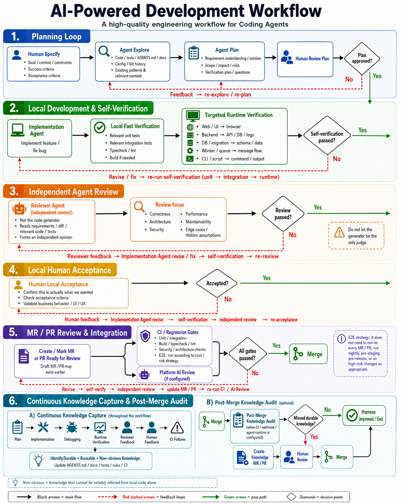

# Agentize Skill

[English](README.md) | [简体中文](README.zh-CN.md)

**Make your codebase agent-ready.**

Agentize Skill is a vendor-neutral coding-agent Skill that bootstraps an existing repository for reliable, human-in-the-loop AI development. It inspects the project, repairs or adds the smallest useful repository-owned context and workflow, reports capabilities that still need setup, verifies its changes, and exits.

> **Agentize Skill should leave behind the system, not become the system.**

The result lives in the target repository. Future coding-agent sessions should work from the instructions, docs, checks, CI, tools, and decision paths left there, whether the host is Claude Code, Codex, Gemini CLI, Kimi CLI, or another compatible agent; they should not need Agentize Skill as a runtime dependency.

## Quick start

By default, install Agentize Skill at user scope so it is available across repositories. Send this host-neutral prompt to a coding agent that can install Agent Skills:

```text
Install the repository-root Agent Skill from https://github.com/woai3c/agentize-skill at user scope, following this host's documented Agent Skills installation mechanism. Install the complete package as agentize-skill, verify that its SKILL.md declares name: agentize-skill, and report the installed path. Do not run it yet.
```

To keep Agentize Skill only in the repository you are currently preparing, replace `at user scope` in the prompt above with `at repository scope for the current repository`.

Then open the repository you want to prepare, select or invoke the installed Skill using that host's normal mechanism, and ask:

```text
Use Agentize Skill to bootstrap this existing repository as a self-contained, human-in-the-loop AI development harness. Preserve its current tools and conventions, make the smallest evidence-backed changes, expose unsupported capabilities and human setup honestly, verify the result, and finish with a scoped Harness Capability Report and separate task outcomes.
```

If the newly installed Skill is not visible, refresh the host's Skill list or start a new agent session. See [Install and use](#install-and-use) for the installation contract, a documented Codex example, read-only audits, and focused repairs.

## What it does

A normal bootstrap run:

1. binds the exact target and inventories its existing agent instructions, documentation, manifests, commands, tests, CI, runtime paths, and learning mechanisms without executing project code during discovery or treating a nested Agentize Skill installation as project evidence;
2. compares direct evidence with the ideal AI-native workflow and distinguishes observed facts, inference, unknowns, operational readiness, and current-task outcomes;
3. repairs existing sources of truth or adds only the smallest missing repository-owned instruction, context, verification, review, acceptance, and knowledge-capture paths;
4. creates focused setup guidance when credentials, permissions, accounts, test data, browser control, runners, external settings, or model integration still require a human;
5. verifies the resulting paths, claims, commands, checks, and diff, then hands off a scoped Harness Capability Report.

It adapts instead of installing a fixed scaffold:

| Starting point | Result |
| --- | --- |
| No effective agent workflow | Establish the smallest useful harness and expose remaining gaps. |
| Partial workflow | Preserve useful material and fill consequential gaps. |
| Conflicting or stale workflow | Reconcile effective behavior from evidence and surface unresolved intent. |
| Mature workflow | Make a narrow repair or produce an evidence-backed no-change result. |

Agentize Skill keeps the root Agent instruction file concise and navigational. It reuses maintained knowledge owners first; when none exists and evidence-backed content warrants a new owner, it uses focused files under `docs/product/`, `docs/architecture/`, `docs/development/`, `docs/verification/`, or `docs/operations/`. These are fallback locations, not an empty tree generated in every repository. Semantic knowledge remains distinct from any Test, Lint, Type Rule, Architecture Check, script, or CI Gate that enforces its deterministic portion. An existing `ARCHITECTURE.md` may be preserved, but Agentize Skill does not create it by default.

An explicit `audit only`, `report only`, or `do not modify` request is static and read-only by default. Agentize Skill may inspect command definitions but does not run project-defined tests, builds, package scripts, linters, or runtime flows unless the user separately requests a named dynamic check.

## Workflow it leaves behind

The diagram shows the ideal full path, not a mandatory checklist for every task or a claim that every pictured capability is active. Independent Agent Review applies when a suitable fresh-context review path is available or repository policy requires it; Platform AI Review applies only when configured. Fast-path work may omit independent Agent review when repository policy considers deterministic checks and self-review proportionate.

The diagram intentionally compresses the feedback arrows so the main lifecycle stays readable. A requirement or accepted-plan problem returns to Specify or Plan; an implementation or review defect returns through Execute, the relevant verification, applicable independent re-review, and Human Acceptance.

[](docs/workflow.en.png)

```text
Specify -> Explore -> Plan <-> Human Plan Review -> Execute <-> Local Fast Verification -> Targeted Runtime Verification
  -> [Independent Reviewer Agent when applicable] -> Human Local Acceptance
  -> Create / Mark MR/PR Ready for Review <-> MR/PR CI + [Platform AI Review when configured] -> Merge
```

Continuous Knowledge Capture spans active development. Full E2E follows the repository's explicit cost- and risk-aware policy and may run per MR/PR, at test or staging promotion, on a schedule, before release, or in a documented combination. Shipping and production observation are conditional on the kind of project. Automatic Post-Merge Knowledge Audit is an optional configured backstop for durable knowledge missed late in the lifecycle, not a minimum daily step.

Agentize Skill creates or repairs only the repository-owned pieces supported by evidence, available tools, authorization, and proportionate cost. It keeps the workflow contract, repository evidence, capability readiness, human setup, and current execution results separate. The detailed responsibility and return-loop rules live in [`references/delivery-workflow.md`](references/delivery-workflow.md).

| Agentize Skill can establish when supported | Human or external setup may still be required |
| --- | --- |
| Concise Agent instructions and context routing; an adaptive workflow contract; verified project commands and verification guidance; a Harness Capability Report; focused Setup Guides; and safe repository-local tests, rules, scripts, or CI definitions when the project evidence and authorization justify them. | Product intent, plan approval, risk decisions, and acceptance; credentials, accounts, test identities and data; browser or runtime environments; external CI and forge settings; branch protection; platform Reviewer Agent runners and model integration; preview or staging; observability; deployment permissions; and merge-trigger automation. |

If a pictured stage is unavailable, Agentize Skill records its scoped status, consequence, fallback, and required setup. A generated instruction, workflow file, or template is not proof that the corresponding automation is active.

For non-trivial work, an available fresh-context Reviewer Agent examines the candidate and available verification evidence before Human Local Acceptance, then returns findings through implementation and verification. Implementer self-review remains explicitly non-independent; a same-model fresh session provides context separation but not model diversity. Fast-path work may omit the second Agent when repository policy considers deterministic checks proportionate. Platform AI review is assessed separately and exists only when its remote automation is actually configured.

Every applicable capability is reported with one operational status:

| Status | Meaning |
| --- | --- |
| `READY` | The complete path is configured and verified for the named scope. |
| `PARTIAL` | A useful bounded subset works and the missing portion is explicit. |
| `SETUP REQUIRED` | A concrete path is selected and repository-side work is present, but a named human action or external prerequisite remains. |
| `NOT CONFIGURED` | The capability applies, but no usable path is currently configured or selected. |
| `UNVERIFIED` | Evidence is insufficient or safe verification could not be completed. |
| `NOT APPLICABLE` | The capability does not apply to this repository or scope. |

Current-task checks use `PASSED`, `FAILED`, `NOT EXECUTED`, or `NOT APPLICABLE` separately. A file, dependency, workflow definition, or green test is not by itself proof that a capability is ready or that the implementation matches human intent.

For artifacts changed by the bootstrap, the handoff separately records the highest repository-delivery evidence: `WORKTREE ONLY`, `COMMITTED`, or `PUSHED`. `PLATFORM ACTIVE` is a separate, revision-specific claim used only when the forge or runner behavior is directly verified. A local PR template or CI file is not presented as active on the forge.

Agentize Skill cannot invent product intent, approve its own plan or acceptance, choose risk tolerance, provide unavailable credentials or infrastructure, or prove external branch protection. A local independent Reviewer Agent depends on a verified fresh-session or delegation boundary in the named host; an automated platform reviewer or post-merge Agent additionally needs a real runner, permissions, and project-selected model integration. When a required capability cannot be established safely, the correct output is an explicit gap, setup path, and human fallback rather than pretend automation.

## Install and use

### Installation contract

The open [Agent Skills specification](https://agentskills.io/specification) standardizes the Skill package, not a universal installation path or command. Follow the active host's documented discovery mechanism.

Install the complete repository root because `SKILL.md` uses the bundled `references/` and `scripts/`. The repository name, `SKILL.md` machine name, and canonical installation-directory name are `agentize-skill`; the display name is `Agentize Skill`. If an installer requires an in-repository source path, use `.`. Installation is complete when the package is in the selected discovery scope and the installed `SKILL.md` declares `name: agentize-skill`.

User and repository scope are both valid:

| Scope | Availability | Typical use |
| --- | --- | --- |
| User | Across that user's repositories | Repeated bootstrap or audit work. |
| Repository | Only within that repository tree | Evaluation, project-specific pinning, or team sharing. |

A repository-scoped copy does not become a runtime dependency of the target project. When it is nested inside the target, the scanner excludes that exact Agentize Skill package from project evidence. Agentize Skill will not change the target's ignore, formatter, Lint, typecheck, test, build, package, or CI configuration merely to accommodate its own files; move the installation if the copy interferes with project checks.

If the host supports Agent Skills but has no installer, use its documented manual installation process. If it cannot load Agent Skills, this package cannot be installed there as a Skill. For a reproducible install, record the source revision alongside the installed path.

### Host-specific example: Codex

Codex is one documented host example, not a requirement or runtime dependency. [Codex discovers local Skills from multiple scopes](https://learn.chatgpt.com/docs/build-skills#where-codex-loads-local-skills):

| Scope | Codex location |
| --- | --- |
| User | `~/.agents/skills/agentize-skill/` |
| Repository | `<repository>/.agents/skills/agentize-skill/` |

In Codex, `$skill-installer` can install Skills for local use, and the installed Skill can be selected in the Skill UI or invoked as `$agentize-skill`. Other hosts may use different paths, installers, pickers, or selectors; `.agents/skills`, `$skill-installer`, and `$agentize-skill` are Codex examples rather than cross-host requirements.

After installation, select `Agentize Skill` using the active host's normal mechanism. You do not need to run the bundled scanner yourself.

### Other ways to use it

Read-only audit:

```text
Use Agentize Skill to audit this repository's AI development harness. Do not modify files or run project-defined commands. Report evidence, conflicts, gaps, unknowns, setup needs, and fallbacks.
```

Focused repair:

```text
Use Agentize Skill to reconcile this repository's agent instructions and real verification paths. Keep unrelated files unchanged.
```

Normally one successful bootstrap is enough. Future feature and bug work should follow the harness left in the repository. Run Agentize Skill again only when you intentionally want to audit or repair that harness after the project or tooling changes.

## Scanner

Ordinary users do not need to run the scanner manually. The two implementations use only their runtime standard library, perform a static read-only inventory, and never execute declared project commands:

```text
node scripts/scan_repo.cjs --root /path/to/repository --format markdown
node scripts/scan_repo.cjs --root /path/to/repository --format json
python scripts/scan_repo.py --root /path/to/repository --format markdown
python scripts/scan_repo.py --root /path/to/repository --format json
```

Schema v7 bounds the scan by files, directories, depth, per-file bytes, and reported-list size; skips directory symlinks and non-regular files plus file symlinks that would re-enter excluded, ignored, vendored, over-depth, or repository-external paths; inventories recognized instruction rules, Reviewer guidance, Agent definitions, prompts, commands, or workflows, and conservative direct Claude, Gemini, and Copilot-compatible `@path` import edges found in rendered Markdown prose; conservatively recognizes verification commands; and redacts common credential syntax on a best-effort basis. Imported files can contain further imports, so the assessing Agent follows relevant edges recursively instead of treating the direct inventory as a complete context graph. Reports remain sensitive local evidence and should be inspected before sharing. Traversal limits are reported in `scan.truncated` and `scan.limit_reasons`; access and relevant parse failures appear in `scan.warnings`; `scan.traversal_incomplete` covers either kind of incomplete traversal; bounded output fields are reported separately in `scan.report_truncated` and `scan.report_truncated_sections`, and derived ecosystem detection still uses the complete scanned manifest set. When traversal or relevant evidence collection is incomplete, absence diagnostics are reported as incomplete rather than definitive. Traversal limits can be adjusted with `--max-files`, `--max-directories`, and `--max-depth`.

Use repeatable `--exclude-path <path-inside-root>` arguments for exact files or directories that are bootstrap tooling rather than target evidence. Relative exclusions are resolved from `--root`, outside or missing paths are rejected, and `scan.excluded_paths` records the effective exclusions. Exclusions use filesystem identity, so alternate casing or a file symlink cannot reintroduce excluded evidence. When a bundled scanner itself runs from a nested package whose `SKILL.md` declares `name: agentize-skill`, it automatically excludes only that package as a defense in depth; a copied scanner in an unrelated package does not trigger this behavior, and other repository-owned Skills remain visible.

Git queries strip inherited `GIT_*` repository selectors, reject a `git` executable that resolves inside the target repository, and inspect only repository identity and branch. They do not run `status` or `diff`, because content comparison may execute repository-configured filters. Worktree state is therefore `unverified`, never silently clean. Repository identity is tri-state: `true` is verified, `false` means no Git marker was found for the target or its ancestors, and `null` means a marker exists but identity could not be verified.

Agentize Skill tries the Node.js scanner first, then Python when the first implementation is unavailable, incompatible, or fails to return a valid report. If neither works, it uses the host's existing read-only tools, discloses the scanner failure, and marks unavailable deterministic facts `unverified`. It never installs or upgrades a runtime merely to scan.

## Repository layout

- `SKILL.md` contains activation, safety, coordination, and handoff rules.
- `references/assessment.md` owns evidence and capability classification.
- `references/delivery-workflow.md` owns the durable development-stage and return-loop contract.
- `references/artifacts.md` owns adaptive repository output selection and artifact contents.
- `references/compatibility.md` owns multi-host and provider-specific reconciliation.
- `scripts/scan_repo.py` and `scripts/scan_repo.cjs` implement the same dependency-free scanner contract.
- `docs/workflow.en.png` and `docs/workflow.png` illustrate the ideal English and Chinese lifecycle summarized above.
- `tests/test_scanners.py` contains deterministic scanner safety, boundary, and cross-runtime parity regressions.
- `tests/test_package_identity.py` prevents the repository name, Skill name, selector, and installation path from drifting apart again.
- `.github/workflows/ci.yml` runs the deterministic tests, both scanners, syntax checks, and Skill package validation on pushes to `main` and pull requests.
- `agents/openai.yaml` is optional OpenAI UI metadata and is not part of the vendor-neutral core.

## Development

Run the deterministic checks from the repository root:

```text
python -m unittest discover -s tests -v
node scripts/scan_repo.cjs --root . --format markdown
python scripts/scan_repo.py --root . --format markdown
git diff --check
```

Also validate the Skill with an Agent Skills validator available in the current development environment. In a Codex source checkout, use the installed `skill-creator` validator; its absolute path and PyYAML environment are host-specific and must not be committed to portable scripts or CI. GitHub CI instead installs a pinned revision of the upstream `skills-ref` reference validator as development-only tooling.

The Python `unittest` suite is a development harness, not an installation dependency. It exercises both scanners when Node.js is available. Scanner behavior has deterministic regression coverage. A cross-host behavior evaluation would actually launch Agentize Skill in multiple agent products and score their actions on controlled repositories; that requires separate host runtimes, credentials, model calls, trace capture, and behavioral grading. It is intentionally outside deterministic pull-request CI, is not required to install or use the Skill, and this repository does not claim that every host has identical discovery, sandbox, approval, Hook, context-refresh, or delegation semantics.

## License

MIT
