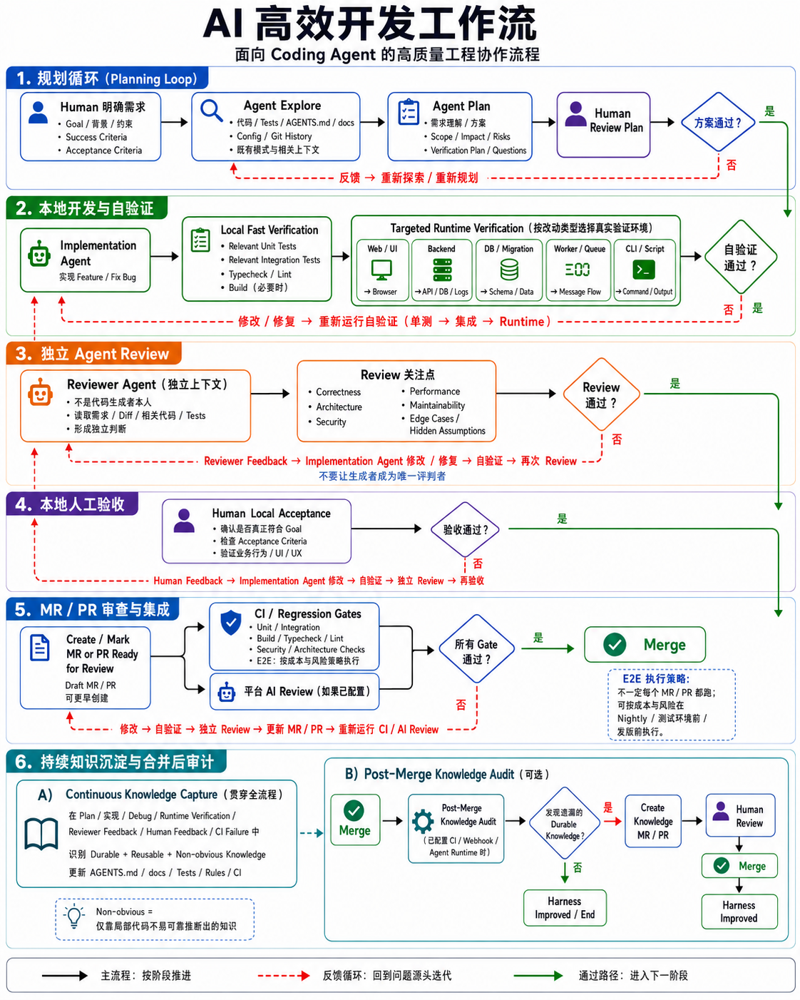

# Agentize Skill

[English](README.md) | [简体中文](README.zh-CN.md)

**让现有代码库成为 Agent-ready Repository。**

Agentize Skill 是一个厂商中立的 Coding Agent Skill，用于把现有仓库一次性改造成可靠、Human-in-the-loop 的 AI 开发环境。它会检查项目，修复或补充最小且有价值的仓库自有上下文与工作流，报告仍需配置的能力，验证变更，然后退出。

> **Agentize Skill should leave behind the system, not become the system.**

最终结果留在目标仓库中。后续 Codex、Claude Code、Gemini CLI、Kimi CLI 或其他 Coding Agent 会依赖仓库留下的指令、文档、检查、CI、工具和决策路径工作，不应把 Agentize Skill 当作运行时依赖。

## 快速开始

把下面这段话发给具备 Skill 安装能力的 Coding Agent：

```text
请使用当前宿主的 Skill 安装器（在 Codex 中使用 $skill-installer），安装下面这个位于仓库根目录的 Agent Skill：
https://github.com/woai3c/agentize-skill

统一使用 agentize-skill 作为 Skill 机器名称和安装目录名。如果安装器要求提供仓库内路径，请使用 .，并显式把目标名称设为 agentize-skill。请按用户级作用域安装，使其在我的所有仓库中可用。如果当前宿主没有安装器但支持 Agent Skills，请按该宿主文档中的手动安装方式，把完整仓库根目录复制到名为 agentize-skill 的用户级目录。安装后验证已安装 SKILL.md 中声明的是 name: agentize-skill，并报告准确安装路径和源码 Revision。如果当前宿主根本不支持加载 Agent Skills，请明确说明 Agentize Skill 未安装并停止，不要改用其他 Skill 或工具。现在不要运行这个 Skill。
```

然后打开需要改造的仓库并发送：

```text
使用 Agentize Skill（支持显式 Skill Selector 时使用 $agentize-skill）把这个现有仓库一次性改造成可独立运行、Human-in-the-loop 的 AI 开发 Harness。保留当前工具和约定，只做最小且有证据支持的变更，诚实暴露尚不支持的能力和人工配置，验证最终结果，并分别交接有明确作用域的 Harness Capability Report 和本次任务结果。
```

只有当 Skill 已位于宿主发现路径中，并且其中的 `SKILL.md` 经过验证，安装才算完成；无关的分析报告不能作为安装证据。如果新安装的 Agentize Skill 尚未出现，请刷新宿主的 Skill 列表或新建一个 Agent 会话。仓库级安装、不同宿主的路径、只读审计和聚焦修复说明见[安装与使用](#安装与使用)。

## 它能做什么

一次普通 Bootstrap 会：

1. 绑定准确目标，并在 Discovery 阶段不执行项目代码、也不把仓库内嵌套安装的 Agentize Skill 当成项目证据的前提下，清点现有 Agent 指令、文档、Manifest、命令、测试、CI、运行时路径和知识学习机制；
2. 用直接证据对照理想的 AI Native Workflow，并区分 Observed Fact、Inference、Unknown、Operational Readiness 和当前任务结果；
3. 优先修复已有事实来源，只补充最小必要的仓库自有指令、上下文、验证、评审、验收和知识捕获路径；
4. 当凭据、权限、账号、测试数据、浏览器控制、Runner、外部设置或模型接入仍需要人类处理时，生成聚焦的配置说明；
5. 验证最终路径、能力声明、命令、检查和 Diff，并交接一份有明确作用域的 Harness Capability Report。

它会适配仓库现状，而不是安装固定脚手架：

| 初始状态 | 结果 |
| --- | --- |
| 没有有效 Agent 工作流 | 建立最小可用 Harness，并暴露剩余缺口。 |
| 工作流不完整 | 保留有用内容，补齐重要缺口。 |
| 工作流冲突或过期 | 根据证据协调实际行为，并暴露尚未解决的意图问题。 |
| 工作流成熟 | 只做聚焦修复，或给出有证据支持的零修改结论。 |

Agentize Skill 会让根 Agent 指令文件保持简洁并主要承担导航职责。它优先复用仍在维护的知识 Owner；如果不存在合适 Owner，并且有证据支持的内容确实值得沉淀，则在 `docs/product/`、`docs/architecture/`、`docs/development/`、`docs/verification/` 或 `docs/operations/` 下创建聚焦文件。这些目录是默认 Fallback，不是每个仓库都要生成的空目录树。语义知识与负责执行其中确定性部分的 Test、Lint、Type Rule、Architecture Check、Script 或 CI Gate 分开表达。已有 `ARCHITECTURE.md` 可以保留，但 Agentize Skill 默认不会创建它。

明确要求“仅审计”“只报告”或“不要修改”时，默认执行静态只读评估。Agentize Skill 可以检查命令定义，但不会运行项目定义的测试、构建、包管理器脚本、Lint 或 Runtime Flow；除非用户另外明确要求某项动态检查。

## 它留下的工作流

为了让主流程保持易读，图片有意简化了部分反馈箭头。需求或已接受方案本身有问题时，应返回 Specify 或 Plan；实现或评审发现缺陷时，应按需返回 Execute，并重新经过相关验证、独立复审与 Human Acceptance。

[](docs/workflow.png)

```text
Specify -> Explore -> Plan <-> Human Plan Review -> Execute <-> Local Fast Verification -> Targeted Runtime Verification -> Independent Reviewer Agent -> Human Local Acceptance -> Create / Mark MR/PR Ready for Review <-> Platform AI Review + MR/PR CI -> Merge
```

Continuous Knowledge Capture 贯穿整个开发过程。Full E2E 遵循仓库明确的 Cost/Risk-aware Policy，可以放在每个 MR/PR、测试或预发布环境晋级、固定时间、Release 前，或采用有文档说明的组合策略。Ship 与生产观察只适用于相应类型的项目。自动 Post-Merge Knowledge Audit 只是用于检查开发后期遗漏 Durable Knowledge 的可选兜底，不是最小日常步骤。

图片展示的是理想的完整路径，不代表 Agentize Skill 能在每个仓库中激活全部阶段。Agentize Skill 只会创建或修复有仓库证据、当前工具、授权和合理成本支持的仓库自有部分，并分别表达 Workflow Contract、Repository Evidence、Capability Readiness、Human Setup 和当前执行结果。详细的职责与返工循环规则位于 [`references/delivery-workflow.md`](references/delivery-workflow.md)。

| Agentize Skill 在条件支持时可以建立 | 仍可能需要人类或外部平台配置 |
| --- | --- |
| 简洁的 Agent 指令与上下文导航；适配仓库的 Workflow Contract；经过验证的项目命令与验证指南；Harness Capability Report；聚焦的 Setup Guide；以及在项目证据和授权支持时安全增加的仓库本地 Test、Rule、Script 或 CI 定义。 | 产品意图、Plan Approval、风险决策和 Acceptance；凭据、账号、测试身份与数据；Browser 或 Runtime Environment；外部 CI 与 Forge 设置；Branch Protection；平台 Reviewer Agent Runner 与模型接入；Preview 或 Staging；Observability；部署权限；Merge-trigger Automation。 |

如果图片中的某个阶段不可用，Agentize Skill 会记录它在明确作用域内的状态、影响、Fallback 和所需配置。生成一份指令、Workflow 文件或 Template，并不能证明对应自动化已经生效。

对于非琐碎任务，如果具备可用的 Fresh-context Reviewer Agent，它会在 Human Local Acceptance 之前审查 Candidate 和已有验证证据，并把 Findings 送回实现与验证循环。Implementer Self-review 会明确标为非独立；同一模型的新 Session 可以提供 Context Separation，但不等于 Model Diversity。Repository Policy 认为确定性检查已经足够时，Fast Path 可以省略第二个 Agent。Platform AI Review 会作为另一项能力单独评估，并且只有远程自动化真实配置后才存在。

每项适用能力使用一种 Operational Status：

| 状态 | 含义 |
| --- | --- |
| `READY` | 对明确作用域，完整路径已经配置并验证。 |
| `PARTIAL` | 一个有用且边界明确的子集可用，缺失部分已明确。 |
| `SETUP REQUIRED` | 已选择具体路径且仓库侧工作已存在，但仍需要明确的人类操作或外部前置条件。 |
| `NOT CONFIGURED` | 能力适用，但当前没有可用且已选择的实现路径。 |
| `UNVERIFIED` | 证据不足，或无法安全完成验证。 |
| `NOT APPLICABLE` | 该能力不适用于当前仓库或作用域。 |

当前任务中的检查另行使用 `PASSED`、`FAILED`、`NOT EXECUTED` 或 `NOT APPLICABLE`。一个文件、依赖、Workflow 定义或绿色测试，本身不能证明能力已经 Ready，也不能证明实现符合人类真实意图。

对于本次 Bootstrap 修改的 Artifact，交接还会单独记录已由证据证明的最高仓库交付阶段：`WORKTREE ONLY`、`COMMITTED` 或 `PUSHED`。`PLATFORM ACTIVE` 是另一项独立且绑定 Revision 的声明，只有在 Forge 或 Runner 行为得到直接验证时才能使用。本地 PR Template 或 CI 文件不能被描述为已在 Forge 上生效。

Agentize Skill 不能虚构产品意图、批准自己的 Plan 或 Acceptance、替人选择风险容忍度、提供不存在的凭据或基础设施，也不能证明外部分支保护已经生效。本地 Independent Reviewer Agent 依赖指定宿主中经过验证的 Fresh Session 或 Delegation Boundary；自动 Platform Reviewer 或 Post-merge Agent 还需要真实 Runner、权限和项目已选择的模型接入。无法安全建立必需能力时，正确结果是明确缺口、配置路径和人工 Fallback，而不是伪造自动化。

## 安装与使用

### 安装细节

仓库名、`SKILL.md` 机器名称、规范安装目录名和显式 Selector 现已统一为 `agentize-skill`；面向用户的显示名称是 `Agentize Skill`。快速开始中的 Prompt 请求的是可跨仓库复用的用户级安装；如果只想在当前仓库使用，请明确说明。具备安装能力的 Agent 应遵循当前宿主的 Skill 发现机制，复制位于仓库根目录的完整 Skill，验证发现状态和已安装 Frontmatter，并报告准确路径与源码 Revision。裸 GitHub URL 只能标识来源；如果安装 Helper 还要求仓库内路径，那么本仓库应传 `.`，并显式把目标名称设为 `agentize-skill`。不支持 Agent Skill 的宿主无法把本仓库作为 Skill 安装，必须如实报告限制，不能转而运行无关工具。

安装后，在宿主的 Skill Picker 中选择 `Agentize Skill`，或者在支持时显式调用 `$agentize-skill`。你不需要自己运行随附扫描器。

### 其他使用方式

只读审计：

```text
使用 Agentize Skill（支持时使用 $agentize-skill）审计这个仓库的 AI 开发 Harness。不要修改文件，也不要运行项目定义的命令。报告证据、冲突、缺口、未知项、配置需求和 Fallback。
```

聚焦修复：

```text
使用 Agentize Skill（支持时使用 $agentize-skill）协调这个仓库的 Agent 指令与真实验证路径。保持无关文件不变。
```

通常一次成功的 Bootstrap 就够了。后续 Feature 和 Bug 工作应直接遵循仓库中留下的 Harness。只有当项目或工具变化后，你明确想重新审计或修复 Harness 时，才需要再次运行 Agentize Skill。

### 手动安装作用域

开放的 [Agent Skills 规范](https://agentskills.io/specification) 标准化 Skill 目录内容，但没有规定通用安装路径。请遵循当前宿主的文档。

例如，[Codex 会从多个作用域发现 Skill](https://learn.chatgpt.com/docs/build-skills#where-codex-loads-local-skills)。可跨仓库复用的用户级安装通常使用：

```text
~/.agents/skills/agentize-skill/
```

仓库级安装使用：

```text
<repository>/.agents/skills/agentize-skill/
```

前者可供该用户的多个仓库使用；后者只作用于对应仓库树。其他宿主可能采用不同约定，所以 `.agents/skills` 不是通用强制规则。

推荐使用用户级安装，因为 Agentize Skill 是一次性 Bootstrap 工具，不是目标项目依赖。如果宿主把它安装在目标仓库内，扫描器会从项目证据中排除这个精确的 Skill 包。Agentize Skill 不会仅为迁就自己的文件而修改目标项目的 Ignore、Formatter、Lint、Typecheck、测试、构建、包或 CI 配置；如果安装副本干扰项目检查，应把它移到用户级作用域。

## 扫描器

普通用户无需手动运行扫描器。两套实现都只使用对应运行时的标准库，执行静态只读清点，并且绝不会执行已声明的项目命令：

```text
node scripts/scan_repo.cjs --root /path/to/repository --format markdown
node scripts/scan_repo.cjs --root /path/to/repository --format json
python scripts/scan_repo.py --root /path/to/repository --format markdown
python scripts/scan_repo.py --root /path/to/repository --format json
```

Schema v7 会限制文件数、目录数、扫描深度、单文件字节数与报告列表大小；跳过目录符号链接和非普通文件，以及会重新进入已排除、已忽略、Vendored、超深度或仓库外路径的文件符号链接；清点能够识别的指令规则、Reviewer 指南、Agent Definition、Prompt、Command 或 Workflow，以及在 Markdown 正文中保守识别出的 Claude、Gemini 和 Copilot-compatible 直接 `@path` 导入边；保守识别验证命令；并对常见凭据语法做尽力脱敏。被导入文件还可能继续导入其他文件，因此评估 Agent 会按需递归跟进相关边，而不会把直接清点结果当作完整 Context Graph。报告仍然属于敏感本地证据，共享前必须检查。遍历限制分别记录在 `scan.truncated` 和 `scan.limit_reasons`；访问失败与相关解析失败记录在 `scan.warnings`；`scan.traversal_incomplete` 同时涵盖因限制或访问失败造成的不完整遍历；报告字段的有界截断另行记录在 `scan.report_truncated` 与 `scan.report_truncated_sections`，生态判断仍使用本次扫描发现的完整 Manifest 集合。遍历或相关证据收集不完整时，缺失诊断会标为 Detection Incomplete，而不是给出确定性结论。可以通过 `--max-files`、`--max-directories` 和 `--max-depth` 调整遍历限制。

可以重复使用 `--exclude-path <仓库内路径>`，精确排除属于 Bootstrap 工具而非目标证据的文件或目录。相对路径从 `--root` 解析，仓库外或不存在的路径会被拒绝，最终排除项会记录在 `scan.excluded_paths`。排除逻辑使用文件系统身份，因此路径的其他大小写写法或文件符号链接不能把已排除证据重新引入。当扫描器自身位于目标仓库内，并且父包的 `SKILL.md` 声明 `name: agentize-skill` 时，它只会自动排除该包作为纵深保护；其他包内复制的扫描器不会触发该行为，其他仓库自有 Skill 仍然可见。

Git 查询会清除继承的 `GIT_*` 仓库选择变量，拒绝实际解析到目标仓库内部的 `git` 可执行文件，并且只检查仓库身份与分支。它不会运行 `status` 或 `diff`，因为内容比较可能执行仓库配置的 Filter。因此 Worktree State 会报告为 `unverified`，绝不会静默当作 Clean。Repository Identity 使用三态：`true` 表示已验证，`false` 表示目标路径及其父级没有 Git Marker，`null` 表示存在 Marker 但无法验证身份。

Agentize Skill 会先尝试 Node.js 扫描器；如果第一套实现不可用、不兼容或无法返回有效报告，再尝试 Python。两者都无法工作时，它会使用宿主已有的只读工具，明确披露扫描器失败，并将无法获得的确定性事实标为 `unverified`。它不会仅为扫描而安装或升级运行时。

## 仓库结构

- `SKILL.md` 包含激活边界、安全、协调和交接规则。
- `references/assessment.md` 负责证据与能力分类。
- `references/delivery-workflow.md` 负责长期开发阶段和返工循环契约。
- `references/artifacts.md` 负责自适应 Repository Output 的选择和内容。
- `references/compatibility.md` 负责多宿主与 Provider-specific 协调。
- `scripts/scan_repo.py` 和 `scripts/scan_repo.cjs` 实现同一个无第三方依赖的扫描器契约。
- `docs/workflow.en.png` 和 `docs/workflow.png` 分别展示上文概括的英文与中文理想生命周期。
- `tests/test_scanners.py` 包含确定性的扫描器安全、边界和跨运行时 parity 回归测试。
- `tests/test_package_identity.py` 防止仓库名、Skill 名、Selector 和安装路径再次出现漂移。
- `.github/workflows/ci.yml` 会在推送到 `main` 和 Pull Request 时运行确定性测试、两套扫描器、语法检查与 Skill 包校验。
- `agents/openai.yaml` 是可选的 OpenAI UI 元数据，不属于厂商中立核心。

## 开发

在仓库根目录运行确定性检查：

```text
python -m unittest discover -s tests -v
node scripts/scan_repo.cjs --root . --format markdown
python scripts/scan_repo.py --root . --format markdown
git diff --check
```

另外还应使用当前开发环境可用的 Agent Skills Validator 验证 Skill。在 Codex 源码环境中可使用已安装 `skill-creator` 的 Validator；其绝对路径和 PyYAML 环境与宿主有关，不能写入便携脚本或 CI。GitHub CI 会改用固定 Revision 的上游 `skills-ref` 参考 Validator，并且只把它作为开发期工具。

Python `unittest` Suite 只属于开发 Harness，不是安装依赖；Node.js 可用时它会同时验证两套扫描器。扫描器行为已有确定性回归覆盖。跨宿主行为 Eval 会在多个 Agent 产品中实际运行 Agentize Skill，并对它在受控仓库中的操作进行评分；这需要额外的宿主 Runtime、凭据、模型调用、Trace 采集和行为判定。它被有意放在确定性的 Pull Request CI 之外，不影响 Skill 的安装和使用；本仓库也不声称所有宿主具有相同的 Skill 发现、Sandbox、审批、Hook、Context Refresh 或委派语义。

## 许可证

MIT
